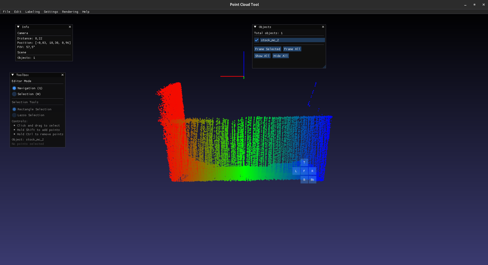

# MyPointCloudEngine

A lightweight engine for rendering and visualizing point clouds with customizable cameras and rendering options. Designed for experimentation, photography-like captures, and graphics research.

## Features

* **Point Cloud Rendering**

  * Supports multiple color modes:

    * Gradient
    * Axis-based colors (X, Y, Z)
    * RGB
    * Flat color
* **Axis Lines** for spatial reference
* **Custom Background**
* **Camera Support**

  * Orthographic projection
  * Perspective projection

## Installation

1. Clone the repository:

   ```bash
   git clone <repo-url>
   ```
2. Build with your preferred C++ compiler (supports C++17+):

   ```bash
   cd pointcloudtool
   mkdir build && cd build
   cmake ..
   make
   ./pointcloudtool
   ```
## Preview
  

## Tutorial
[](https://youtu.be/KtLUAVpZ7DA)

## Supported Color Modes

* **Gradient** – colors based on position along an axis
* **Axis Colors** – X = Red, Y = Green, Z = Blue
* **RGB** – uses point-specific RGB values
* **Flat Color** – single color for all points

##  TODO
* Implement additional camera controls (orbit, pan, zoom)
* Fix labeling system
* Add point cloud editing and filtering
* Enable GPU-level optimizations for large point clouds [Priority]
* Add focus to select area [Priority]

## DONE
* Fix coordinate system [Z up, Y forward]
* PLY save/load files 

## License

MIT License
